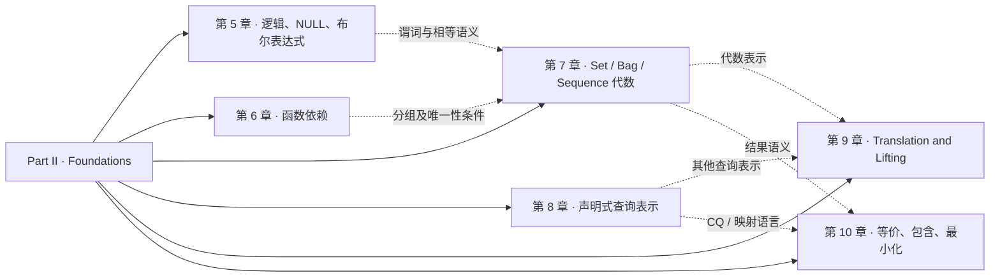
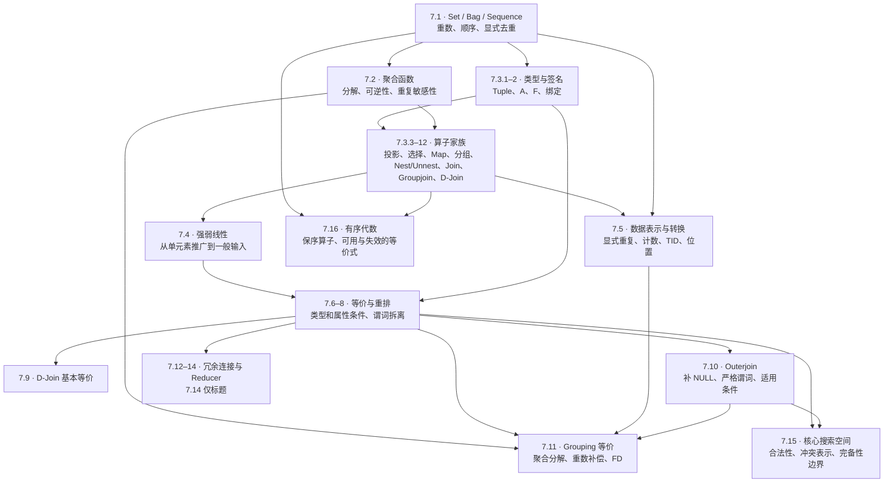

# Foundations 概念地图

阅读对象是 [Building Query Compilers 的 Part II](../Query%20opt.pdf#page=218)。下图先表示主题组织，再表示第 7 章内部依赖；它不是查询执行流程，也不是以某一种改写算法为终点的路线。

## 第二部分的主题结构

第 8 章以提要与文献为主，第 9 章主要是标题；图中保留它们的位置，不意味着原书已经把这些主题完整讲完。第 10 章中的“查询等价”还包括判定问题，与第 7 章具体代数恒等式的使用层次不同。

## 第 7 章的内部结构

图外但持续使用的前提是：第 5 章为比较、过滤、分组及 outer join 提供 NULL 语义，第 6 章为分组键、唯一性和部分消除规则提供 FD 条件。§7.17–18 的文献与 ToDo 用于识别来源和未完成部分，不另设一条概念主线。

## 阅读顺序与依赖的区别

正文主要按原书顺序展开。§7.1 会先出现线性的初步定义，§7.4 再系统讨论；§7.2 先定义聚合函数，§7.3 定义分组算子，§7.11 才讨论复杂分组变换。教材保留这种递进，并通过回链复用前面知识。

Sequence 分两次学习：§7.1.4 建立序列对象与相等，§7.16 学习保序算子。因此不能把“先讲 bag”理解成“sequence 不在范围内”。同样，free attributes 与 binding 服务于全部含表达式参数的算子，并不只为 dependent join 准备。

对应的逐节安排见[教学提纲](outline.md)，原文全目录的覆盖情况见[覆盖表](coverage.md)。
