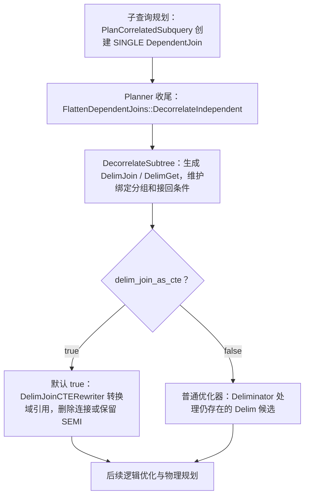

# DuckDB 去相关与等值改写：从一条 SQL 走到源码

DuckDB 对本文等值例子的处理是：**先把外层绑定变成内层可读取的域列，按绑定分别计算；再用等值条件把域列的使用改成内层列，删除不再需要的域连接。如果需要保留聚合前的域过滤，则把底部连接改成半连接。** 理解这条路径，需要同时看绑定值来自哪里、聚合怎样分组，以及结果怎样接回外层。

本文沿用 Spark 调研文档的阅读方式：先看一条 SQL 的输入和目标，再定位阶段，随后逐步追踪计划与绑定的变化。阅读路线：

1. [改写的输入和目标](#query)：相关子查询依赖什么，域起什么作用？
2. [整条调用链](#pipeline)：子查询规划、去相关、CTE 改写分别做什么？
3. [等值例子的逐步执行](#equality)：域怎样生成，两个域引用怎样依次消失？
4. [保留域过滤的分支](#preserve)：为什么替换了域列，还要留下半连接？
5. [判断条件与部分替换](#checks)：能删什么，为什么一个等号还不够？
6. [保留 Delim 的另一条路径](#deliminator)：后续 Deliminator 何时参与？
7. [语义边界](#boundaries)：NULL、空输入、COUNT 和标量多行如何处理？
8. [源码阅读入口与成本问题](#sources)：接下来读哪里，结论能说到哪一步？

源码固定为 `154c2c8d5f67aa8ddbadf93598a4a29051430a0c`，原调查日期 2026-09-06，本文于 2026-09-08 对照该本地快照重新核对并重构。主线限定为开启优化器、未禁用 `DELIMINATOR`、`delim_join_as_cte=true` 的普通确定性相关标量子查询，绑定列使用可按值去重的简单类型。计划图和等价 SQL 是根据代码推导的教学表示，省略列绑定编号、别名投影和无关输出，**不是运行得到的 EXPLAIN**；本文没有执行 DuckDB 测试或性能实验。源码链接沿用本地 DuckDB 工作区跳转。

返回[论文问题与两系统比较](domain-equality-substitution-survey.md)；另见 [Spark 独立调查](spark-domain-equality-code-study.md)。

<a id="query"></a>

## 1. 先看 DuckDB 要把什么改成什么

与 Spark 文档使用同一个例子：从论文 Q1 中取出求最低成绩的部分，暂时不加入外层的另一张 `exams` 表。

```sql
SELECT s.id,
       (SELECT MIN(e2.grade)
        FROM exams e2
        WHERE e2.sid = s.id) AS min_grade
FROM students s;
```

对每一行学生，内层都需要用这个学生的 `s.id` 筛选考试，再求最低成绩。“相关”指内层读取了外层的值；“绑定”指一次内层计算使用的外层取值，例如 `s.id=1`。下文假设 id 与 sid 类型一致，先排除隐式转换的干扰。

内层最初大致是：

```text
Aggregate [分组键: 空] [输出: MIN(e2.grade) AS m]
└─ Filter [e2.sid = outer(s.id)]
   └─ exams e2
```

`outer(s.id)` 在本文图中表示相关列引用，便于与 Spark 文档对照；DuckDB 源码使用带深度信息的列引用，而不是 Spark 的 `OuterReference` 类。此时分组键为空，内层为当前学生计算一个聚合结果。

### 1.1 先把“每次传一个值”变成“一起处理一组绑定”

DuckDB 去相关时引入绑定域 D。对本例，可以把它理解成：

```sql
D = SELECT DISTINCT id FROM students
```

这是一种关系表达式的简写，不是用户必须写的 SQL。D 中每个值只出现一次，内层用 `d.id` 代替 `outer(s.id)`，按 `d.id` 分组：

```text
内层的核心计算：
Aggregate [d.id] [MIN(e2.grade) AS m, d.id]
└─ Join Inner [e2.sid = d.id]
   ├─ exams e2
   └─ D

上层：原 students 按绑定键取回各自的 m
```

这里的 D 有两个作用：**提供绑定值**，以及**让内层只处理 D 中出现的键**。上图先展示核心计算；DuckDB 为原来的无分组聚合还会生成一处额外域匹配，第 3 节会把它画出来。

### 1.2 等值替换后，内层列可以自己提供绑定值

在 `e2.sid=d.id` 成立的行上，聚合使用的 `d.id` 可以改由 `e2.sid` 提供。删除域连接的分支于是得到按 sid 独立聚合的结构。对这个简单 MIN 查询，最终含义可用以下 SQL 理解：

```sql
SELECT s.id, g.m AS min_grade
FROM students s
LEFT JOIN (
    SELECT e2.sid, MIN(e2.grade) AS m
    FROM exams e2
    WHERE e2.sid IS NOT NULL
    GROUP BY e2.sid
) g ON s.id IS NOT DISTINCT FROM g.sid;
```

这里特意保留内层的非 NULL 条件和上层的 NULL 安全匹配，以对应 DuckDB 的改写逻辑。二者合起来仍遵守原查询 `e2.sid=s.id` 的普通等值语义；第 7 节解释为什么不能只看上层比较。

| 位置 | 生成域后 | 等值消除后 | 必须保持什么 |
|---|---|---|---|
| 内层绑定值 | D 提供 `d.id` | `e2.sid` 提供 | 当前计算属于哪个键 |
| 聚合分组 | 按 `d.id` 分组 | 按 `e2.sid` 分组 | 不同绑定分别计算 |
| 聚合前的域匹配 | `e2.sid=d.id` | 删除，保留普通等值的非 NULL 要求 | NULL 不因替换而新增匹配 |
| 接回外层 | 按返回的绑定键取值 | 按改写后的绑定键取值 | 只取本行学生的结果，无考试时得到 NULL |

例如 `students.id={1,3}`，考试行是 `(sid,grade)={(1,80),(1,60),(2,90)}`：

| 步骤 | 结果 |
|---|---|
| 原查询 | 学生 1 得到 60，学生 3 得到 NULL |
| 聚合前保留 D 过滤 | 只有 sid=1 的考试进入聚合 |
| 删除底部域连接 | 内层多算出键 2，聚合得到 `(1,60)`、`(2,90)` |
| 接回 students | 键 2 没有对应外层行；仍得到 `(1,60)`、`(3,NULL)` |

所以，**删除底部域连接不要求 D 与 exams 具有相同的键集合**。正确性依赖完整的“按绑定分组 + 上层按键取回”；代价问题则是多算键 2 是否值得。DuckDB 的半连接保留分支正是围绕后一件事展开。

<a id="pipeline"></a>

## 2. 这些改写接在 DuckDB 的哪个阶段

先区分三个动作：子查询规划建立“右侧依赖左侧”的连接；去相关把这种依赖展开成可显式读取的域；CTE 重写再决定域引用怎样实现、哪些连接可以消除。



图只展示相关节点的处理路线。默认路径结束时已经没有 Delim 节点，后续普通优化器仍会运行，但其中的 `Deliminator` 不会再处理这些已消失的节点。

| 阶段 | 谁调用谁 | 输入与输出 |
|---|---|---|
| 建立相关连接 | `PlanCorrelatedSubquery` → `CreateDuplicateEliminatedJoin` | 标量子查询变成 `LogicalDependentJoin(SINGLE)` 的右子树；原标量表达式改为引用右侧结果列 |
| 展开依赖 | `Planner` → `DecorrelateIndependent` → `DecorrelateSubtree` | 在内层接入域读取、重写相关引用、维护分组，最终生成上层 DelimJoin |
| 默认域重写 | `DecorrelateIndependent` → `DelimJoinCTERewriter::Rewrite` | DelimGet 转成生成域的 CTERef，尝试等值消除或半连接保留 |
| 后续优化 | 普通优化器及物理规划 | 继续优化已经形成的逻辑计划；保留 Delim 的设置走另一条消除路径 |

入口见[标量子查询规划](vscode-remote://wsl+ubuntu-20.04/home/refrain/proj/duckdb/src/planner/binder/query_node/plan_subquery.cpp#L457)、[Planner 调用位置](vscode-remote://wsl+ubuntu-20.04/home/refrain/proj/duckdb/src/planner/planner.cpp#L193)、[flatten 收尾](vscode-remote://wsl+ubuntu-20.04/home/refrain/proj/duckdb/src/planner/subquery/flatten_dependent_join.cpp#L274)。该快照的 [`delim_join_as_cte` 默认值](vscode-remote://wsl+ubuntu-20.04/home/refrain/proj/duckdb/src/common/settings.json#L542)为 true。

### 2.1 MIN 例子的 DependentJoin 是怎样构造出来的

DuckDB 确实有显式的 `LogicalDependentJoin` 算子，类型为 `LOGICAL_DEPENDENT_JOIN`。它表达论文中“右侧计算依赖左侧绑定”的关系；本例还带有 `SINGLE` 语义，用来承载标量子查询。类定义说明它只在规划期间存在，flatten 完成后应被消除。[算子定义](vscode-remote://wsl+ubuntu-20.04/home/refrain/proj/duckdb/src/include/duckdb/planner/operator/logical_dependent_join.hpp#L3)

仍看第 1 节的 `SELECT s.id, (SELECT MIN(e2.grade) FROM exams e2 WHERE e2.sid=s.id)`。构造前，外层 SELECT 列表中的第二项是 `BoundSubqueryExpression`，里面持有已绑定的内层计划；外层当前的关系树 `root` 则是 students 扫描：

```text
外层 SELECT 表达式列表                 当前外层关系树 root
├─ ColumnRef(s.id)                   └─ Scan students s
└─ BoundSubqueryExpression [SCALAR] AS min_grade
   └─ 持有的内层计划
      Project [m]
      └─ Aggregate [分组键: 空] [MIN(e2.grade) AS m]
         └─ Filter [e2.sid = outer(s.id)]
            └─ Scan exams e2
```

这里特意把表达式列表和关系树分开画：源码先对 SELECT 列表调用 `PlanSubqueries(expr, root)`，处理完子查询以后，才创建外层 `LogicalProjection`。`outer(s.id)` 仍是本文对相关列引用的简写。[SELECT 列表处理顺序](vscode-remote://wsl+ubuntu-20.04/home/refrain/proj/duckdb/src/planner/binder/query_node/plan_select_node.cpp#L216)

`PlanSubqueries` 找到这个子查询表达式，经 `Binder::PlanSubquery` 进入 `PlanCorrelatedSubquery` 的 SCALAR 分支，完成三个动作：

1. 从子查询 binder 取得 `correlated_columns=[s.id]`。本例使用简单类型且没有易变表达式，`perform_delim=true`，记录后续可以按绑定值去重。
2. `CreateDuplicateEliminatedJoin` 创建 `LogicalDependentJoin(SINGLE)`，保存相关列和去重标志，将原 `root` 作为左孩子；调用者再把内层计划接为右孩子，并令 `root` 指向新连接。尽管辅助函数名字里有 DuplicateEliminated，这一步尚未创建 D 或 DelimGet。
3. 取内层输出列的绑定 `plan->GetColumnBindings().back()`，返回引用该列的 `BoundColumnRefExpression`，替换原来的整个标量子查询表达式。

随后构造外层 Project，得到下面的树。`q.m` 表示内层 Project 暴露的结果列绑定，不是新算出的聚合：

```text
Project [s.id, ColumnRef(q.m) AS min_grade]
└─ DependentJoin [SINGLE; correlated_columns=[s.id]; perform_delim=true]
   ├─ Scan students s
   └─ Project [m AS q.m]
      └─ Aggregate [分组键: 空] [MIN(e2.grade) AS m]
         └─ Filter [e2.sid = outer(s.id)]
            └─ Scan exams e2
```

**变化是：内层计划从标量表达式内部移到连接的右子树，原表达式改为读取右侧结果列。** 此时等值条件还在内层 Filter，分组键仍为空，`outer(s.id)` 也还没有被消除；新节点用 `correlated_columns` 显式记录这项依赖，本例没有另外设置它的 `condition`。按语义理解，是为每个左侧绑定取得右侧标量结果；这不表示执行阶段一定采用逐行运行子查询的方式。第 3 节的 flatten 才会展开这份依赖、接入域并增加分组。[表达式替换入口](vscode-remote://wsl+ubuntu-20.04/home/refrain/proj/duckdb/src/planner/binder/query_node/plan_subquery.cpp#L748)、[创建左侧与元信息](vscode-remote://wsl+ubuntu-20.04/home/refrain/proj/duckdb/src/planner/binder/query_node/plan_subquery.cpp#L404)、[SCALAR 分支挂接右侧并返回列引用](vscode-remote://wsl+ubuntu-20.04/home/refrain/proj/duckdb/src/planner/binder/query_node/plan_subquery.cpp#L474)

### 2.2 几个名字分别代表什么

| 对象 | 含义 | 本例中承担的工作 |
|---|---|---|
| `DependentJoin` | 右侧仍含相关依赖的逻辑连接 | 保存相关列及标量 SINGLE 语义，等待展开 |
| `DelimJoin` | 展开后标记域来源和接回关系的连接 | 左侧是原外层；`duplicate_eliminated_columns` 指定用于生成绑定域的列 |
| `DelimGet` | 内层读取绑定域的逻辑节点 | 提供 `d.id`；同一域可以有多处读取 |
| 生成域的 `CTERef` | 默认路径中替代 DelimGet 的逻辑引用 | 指向当前生成的去重绑定集合 |
| 普通 `ComparisonJoin` | 由比较条件连接输入的逻辑节点 | 可以是接回外层的连接，也可以是内层域匹配，须按位置区分 |

`SINGLE`、`LEFT`、`SEMI` 描述连接语义；`DELIM_JOIN`、`COMPARISON_JOIN` 描述逻辑节点的类别。把 DelimJoin 改成 ComparisonJoin，本身不等于把 SINGLE 改成 LEFT，也不等于删除这个上层连接。

### 2.3 默认 CTE 路径内部还分哪几步

```text
DelimJoinCTERewriter::Rewrite
  → 将适用的过滤条件推入 DelimJoin 输入
  → RewriteDelimJoinsToCTEs
    → MaterializeDelimJoinAsCTE
      ① 上层 DelimJoin 改为普通 ComparisonJoin
      ② 右侧 DelimGet 改为当前生成域的 CTERef
      ③ GeneratedDedupRefEliminator::Remove：替换绑定并删除或保留连接
      ④ 检查剩余引用数
         为 0：无需构造这个域的 CTE 定义
         非 0：构造共享外层输入和去重域的 CTE 定义
  → GeneratedDomainJoinEliminator：清理剩余可消除的生成域连接
  → VerifyNoDelim
```

先创建 CTERef，再决定是否需要 CTE 定义，都是逻辑计划构造。函数名 `MaterializeDelimJoinAsCTE` 不表示这里已经执行、去重或物化了数据。`GeneratedDedupRefEliminator` 还受优化器总开关和 `DELIMINATOR` 禁用配置控制。[转换与消除入口](vscode-remote://wsl+ubuntu-20.04/home/refrain/proj/duckdb/src/planner/subquery/delim_join_cte_rewriter.cpp#L2479)、[整体重写流程](vscode-remote://wsl+ubuntu-20.04/home/refrain/proj/duckdb/src/planner/subquery/delim_join_cte_rewriter.cpp#L2693)

<a id="equality"></a>

## 3. 顺着等值例子走一遍计划变化

本节沿第 1 节无外层过滤的 MIN 查询，追踪默认 CTE 路径的删除分支。先生成域，再自底向上消除；两次遍历的职责要分开看。

### 3.1 去相关时，递归传递的是“绑定现在由哪些列提供”

`FlattenDependentJoins` 保存 `correlated_columns`，递归返回 `UnnestingState`。与本例最相关的是：

| 信息 | 含义 | 本例如何变化 |
|---|---|---|
| `correlated_columns` | 当前需要展开的外层相关列 | `[s.id]` |
| `UnnestingState.bindings` | 当前子树用哪些输出列表示这些外层值 | 扫描附近是 `d_scan.id`，经过聚合及额外匹配后换成新的输出绑定 |
| `UnnestingState.replacement_graph` | 子树重写产生的列绑定替换 | 帮助父节点在子输出变化后继续引用正确的列 |

这里的列绑定是源码中标识某个算子输出列的 `ColumnBinding`，不只是 SQL 列名。表格中的名字是教学简写。后面的等值消除器也使用 `BindingReplacementGraph`，但那是另一轮重写，负责把域列改由内层列表示。[状态定义](vscode-remote://wsl+ubuntu-20.04/home/refrain/proj/duckdb/src/include/duckdb/planner/subquery/flatten_dependent_join.hpp#L33)、[递归入口](vscode-remote://wsl+ubuntu-20.04/home/refrain/proj/duckdb/src/planner/subquery/flatten_dependent_join.cpp#L310)

### 3.2 向下接入域，向上重写 Filter 和分组

忽略别名 Project，沿 `Aggregate → Filter → exams`：

```text
① PushDownAggregate 向下处理 Filter
   当前相关列是 [s.id]

② Filter 通过 PushDownChild 继续向下
   exams 本身没有相关引用
   AttachDomainToIndependentSubtree 接入一个 DelimGet

   CrossProduct
   ├─ exams e2
   └─ DelimGet D → d_scan.id

③ 返回 Filter
   将 outer(s.id) 改写为当前绑定 d_scan.id
   Filter 变成 e2.sid = d_scan.id

④ 返回 Aggregate
   AddDelimColumnsToGroup 把 d_scan.id 加入分组
   聚合输出 MIN(e2.grade) AS m，以及分组键 g.id
```

此时底部是 `Filter + CrossProduct`，等价于第 1 节画的 Inner Join。这个形状有自己的消除入口，不能把所有等值操作都归到 `RemoveJoin`。[Filter/聚合分派](vscode-remote://wsl+ubuntu-20.04/home/refrain/proj/duckdb/src/planner/subquery/flatten_dependent_join.cpp#L1424)、[接入域](vscode-remote://wsl+ubuntu-20.04/home/refrain/proj/duckdb/src/planner/subquery/flatten_dependent_join.cpp#L1506)、[父表达式重写](vscode-remote://wsl+ubuntu-20.04/home/refrain/proj/duckdb/src/planner/subquery/flatten_dependent_join.cpp#L490)、[增加绑定分组](vscode-remote://wsl+ubuntu-20.04/home/refrain/proj/duckdb/src/planner/subquery/flatten_dependent_join.cpp#L756)

### 3.3 原来是无分组聚合，因此还会有第二个域引用

原 SQL 的 `MIN` 没有 GROUP BY。`PushDownAggregate` 在新增绑定分组之后识别这种情况，在聚合上方再接一个 DelimGet，用 NULL 安全比较匹配分组键。对本文直接返回 MIN、可传播 NULL 的形状，这里使用 INNER；需要维护非 NULL 空输入结果的形状可能使用 LEFT，第 7 节再看。

`FinalizeDependentJoin` 随后用返回的绑定状态建立最外层的接回条件。省略投影后的结构是：

```text
DelimJoin SINGLE [s.id IS NOT DISTINCT FROM d_result.id]
├─ students s                         -- 域来源，去重列为 s.id
└─ Join Inner [d_result.id IS NOT DISTINCT FROM g.id]
   ├─ DelimGet D → d_result.id         -- 聚合上方的域引用
   └─ Aggregate [d_scan.id] [MIN(e2.grade) AS m, 分组输出 g.id]
      └─ Filter [e2.sid = d_scan.id]
         └─ CrossProduct
            ├─ exams e2
            └─ DelimGet D → d_scan.id  -- 聚合下方的域引用
```

两处 DelimGet 读取同一个 D，但有不同的输出列绑定。`g.id` 是 Aggregate 的分组输出，其输入表达式此时为 `d_scan.id`。当学生没有考试时，中间 INNER 不产生该键的行，最外层 SINGLE 为该学生补出 NULL；这与本例 MIN 的空输入结果相符。[全局聚合处理](vscode-remote://wsl+ubuntu-20.04/home/refrain/proj/duckdb/src/planner/subquery/flatten_dependent_join.cpp#L805)、[上层绑定条件](vscode-remote://wsl+ubuntu-20.04/home/refrain/proj/duckdb/src/planner/subquery/flatten_dependent_join.cpp#L252)、[完成 DependentJoin](vscode-remote://wsl+ubuntu-20.04/home/refrain/proj/duckdb/src/planner/subquery/flatten_dependent_join.cpp#L617)

### 3.4 转换为 CTERef，然后先删除聚合下方的域连接

`MaterializeDelimJoinAsCTE` 将两处 DelimGet 变成指向同一生成域的 CTERef，上层连接类别改为 ComparisonJoin。`GeneratedDedupRefEliminator::Remove` 检查本例域来源，得到 `preserve_selected_domain=false`，随后 `RewriteSubtree` 自底向上遍历。

底部首先被处理：

```text
RemoveFilterCrossProduct
  输入：Filter [e2.sid = d_scan.id] over (exams × CTERef D)
  覆盖检查：D 只有 id 一列，等值条件已覆盖它
  建立替换：d_scan.id → e2.sid
  删除域侧与 CrossProduct，保留 e2.sid IS NOT NULL
  更新上方使用 d_scan.id 的表达式

结果：
Aggregate [e2.sid] [MIN(e2.grade) AS m, 分组输出 g.id]
└─ Filter [e2.sid IS NOT NULL]
   └─ exams e2
```

Aggregate 的分组输入变了，输出仍通过自己的列绑定 `g.id` 暴露给父节点。实现既通过替换访问器更新引用，也在递归返回时调用 `ColumnBindingRewrite::ApplyToChild` 维护父节点。**删除域节点与修正其使用位置是同一个改写的两部分。** [自底向上的分支选择](vscode-remote://wsl+ubuntu-20.04/home/refrain/proj/duckdb/src/planner/subquery/delim_join_cte_rewriter.cpp#L1082)、[Filter + CrossProduct 删除](vscode-remote://wsl+ubuntu-20.04/home/refrain/proj/duckdb/src/planner/subquery/delim_join_cte_rewriter.cpp#L1647)

### 3.5 再删除聚合上方的域连接，最后接回外层

递归返回到聚合上方的 Inner Join：

```text
RemoveJoin
  输入：CTERef D 与聚合结果，条件为 d_result.id IS NOT DISTINCT FROM g.id
  建立替换：d_result.id → g.id
  删除该域侧，把 Join 替换为聚合子树
  原条件变成 g.id IS NOT DISTINCT FROM g.id，恒真，可删除
  最外层的接回条件随之改为 s.id IS NOT DISTINCT FROM g.id
```

现在两处生成域引用都消失了。`Remove` 重新计数返回 0，CTE 转换入口无需再构造共享外层输入和域的 CTE 定义。只删掉底部一个连接时，还不能得出这个结论。[等值 Join 删除与引用更新](vscode-remote://wsl+ubuntu-20.04/home/refrain/proj/duckdb/src/planner/subquery/delim_join_cte_rewriter.cpp#L1509)、[引用计数](vscode-remote://wsl+ubuntu-20.04/home/refrain/proj/duckdb/src/planner/subquery/delim_join_cte_rewriter.cpp#L1766)

该简单聚合形状的分组键被上层等值条件覆盖，`SingleJoinRHSIsDeduplicated` 能确认每个匹配键至多一行，于是把 SINGLE 改为 LEFT。本例没有上方拒绝 NULL 的 Filter，最终核心结构为：

```text
Project [s.id, m AS min_grade]
└─ Join Left [s.id IS NOT DISTINCT FROM g.id]
   ├─ students s
   └─ Aggregate [e2.sid] [MIN(e2.grade) AS m, 分组输出 g.id]
      └─ Filter [e2.sid IS NOT NULL]
         └─ exams e2
```

这就回到了第 1 节的目标。后续优化还可能整理投影或过滤表达式；这里关心的是域不再参与、分组仍然隔离绑定、上层仍然取回对应结果。[SINGLE 唯一性检查](vscode-remote://wsl+ubuntu-20.04/home/refrain/proj/duckdb/src/planner/subquery/delim_join_cte_rewriter.cpp#L2426)、[连接类型调整和跳过 CTE 定义](vscode-remote://wsl+ubuntu-20.04/home/refrain/proj/duckdb/src/planner/subquery/delim_join_cte_rewriter.cpp#L2486)

<a id="preserve"></a>

## 4. 外层有过滤时，为什么替换了域列还留下半连接

给同一个查询加一个外层条件：

```sql
SELECT s.id,
       (SELECT MIN(e2.grade)
        FROM exams e2
        WHERE e2.sid = s.id) AS min_grade
FROM students s
WHERE s.active = true;
```

这次 D 来自筛选后的学生：`SELECT DISTINCT id FROM students WHERE active=true`。如果只选中少量学生，先用 D 限制考试行，可能比对所有 sid 聚合便宜得多。

### 4.1 分支判断发生在哪里

CTE 重写先把适用的过滤条件推入 DelimJoin 输入。`GeneratedDedupRefEliminator::Remove` 再调用 `HasDelimiterDomainSelection` 检查域来源，令 `preserve_selected_domain` 表示该来源是否被判定具有选择条件。

`RewriteSubtree` 向下传递 `under_aggregate`；对本文底部连接，父节点包含 Aggregate，因此它为 true：

```text
域来源有选择条件 && 当前连接在 Aggregate 下方
  → 尝试保留为 SEMI
否则
  → 尝试删除
```

实际源码还对满足额外条件的存在性判断分支传播 `under_evidence_side`，将其与 `under_aggregate` 并列保护。那是 EXISTS 等场景的扩展，不影响本文 MIN 的追踪。保留函数的适用性检查失败时，这个局部候选保留原形状。[选择标志来源](vscode-remote://wsl+ubuntu-20.04/home/refrain/proj/duckdb/src/planner/subquery/delim_join_cte_rewriter.cpp#L1766)、[分支位置](vscode-remote://wsl+ubuntu-20.04/home/refrain/proj/duckdb/src/planner/subquery/delim_join_cte_rewriter.cpp#L1082)

### 4.2 半连接保留什么，替换又改了什么

对第 3 节的底部形状，入口为 `PreserveFilterCrossProductAsSemi`；对显式 Join，则为 `PreserveJoinAsSemi`。它们将非域输入放在输出侧，把上方使用的域列改成内层列，同时保留半连接内部与 D 的真实比较：

```text
Aggregate [e2.sid] [MIN(e2.grade) AS m, 分组输出 g.id]
└─ SemiJoin [e2.sid = d_scan.id]
   ├─ exams e2
   └─ CTERef D → d_scan.id
```

SEMI 只返回 exams 一侧的行，回答“这个 sid 在 D 中有没有匹配”。Aggregate 已不再从 D 取得分组值，但进入聚合的行仍由 D 筛选。替换访问器会在保留的半连接处停止，避免把内部条件也改成自比较。[Join 半连接转换](vscode-remote://wsl+ubuntu-20.04/home/refrain/proj/duckdb/src/planner/subquery/delim_join_cte_rewriter.cpp#L1281)、[Filter + CrossProduct 半连接转换](vscode-remote://wsl+ubuntu-20.04/home/refrain/proj/duckdb/src/planner/subquery/delim_join_cte_rewriter.cpp#L1389)

聚合上方的额外域匹配本身不在 Aggregate 下方，在本例仍可删除。底部 SEMI 留下一处域引用，CTE 转换入口因此需要构造域定义。后续 `GeneratedDomainJoinEliminator` 也检查选择性域在聚合或存在性判断下的保护条件。[后续清理的保护条件](vscode-remote://wsl+ubuntu-20.04/home/refrain/proj/duckdb/src/planner/subquery/delim_join_cte_rewriter.cpp#L2113)

| 问题 | 删除底部连接 | 保留底部 SEMI |
|---|---|---|
| 聚合键从哪里来？ | `e2.sid` | `e2.sid` |
| 聚合前检查 sid 是否在 D 中？ | 不再检查 | 继续精确检查 |
| 是否可能多算外层不需要的键？ | 会 | 该等值半连接先排除这些键 |
| 是否还需要这个域的 CTE？ | 所有引用都消失时不需要 | 需要，SEMI 仍引用它 |

这解释了论文中的两个问题为什么能分别处理：内层列能够提供绑定值，不意味着域的提前过滤作用也没有价值。

### 4.3 “有选择条件”是不是成本估计

`HasDelimiterDomainSelection` 递归检查 Filter、扫描过滤和域来源路径，跳过某些无关的可空侧及子查询判断侧。Filter 分支把某些列等值条件归入不触发保护的类别；扫描过滤则单独跳过 `IS NOT NULL`。[条件分类](vscode-remote://wsl+ubuntu-20.04/home/refrain/proj/duckdb/src/planner/subquery/delim_join_cte_rewriter.cpp#L432)、[域来源路径检查](vscode-remote://wsl+ubuntu-20.04/home/refrain/proj/duckdb/src/planner/subquery/delim_join_cte_rewriter.cpp#L554)

这是计划结构上的启发式判断。它没有读取 D 的不同值数量、内外层键的重叠率或聚合代价来比较两个方案。“不触发保护”也不等于实际数据上没有过滤效果：第 1 节的小 students 表即使没有显式 Filter，D 仍可能筛掉大量 exams 行。

<a id="checks"></a>

## 5. 等值消除究竟检查什么，为什么一个等号还不够

### 5.1 把检查接回第 3 节的动作

`RemoveJoin` 的等值分支不是通用的“见到等号就删 Join”。它在已经知道域来源、分组和上层匹配的上下文中工作：

| 检查 | 本例为什么通过 | 不满足时为什么不能照做 |
|---|---|---|
| 当前是受支持的 INNER / SEMI 形状 | 聚合上方是 INNER | 外连接和标量连接有额外保留行语义 |
| 恰好一侧可追踪为当前生成域引用 | 一侧是当前 D 的 CTERef | 任意表之间的等值 Join 不能套用域消除 |
| 等值比较为 `=` 或 `IS NOT DISTINCT FROM` | 两处域匹配分别使用这两种比较 | 非等值不能直接说明两侧值相同 |
| 另一侧可提取为列绑定，替换图接受映射 | `d_result.id → g.id` | 不能留下冲突或无法重写的列引用 |
| `CoversAllDedupColumns` 通过 | D 只有 id 一列，恰好覆盖一次 | D 按完整元组去重，子集列未必唯一 |
| 域输出及过滤表达式可以重建 | 直接列引用，无额外复杂表达式 | 删除域后不能留下悬空引用或丢掉过滤 |

域识别可以穿过受支持的 Filter / Project 包装；各个删除、保留入口还有各自的形状和投影限制。这张表概括 `RemoveJoin` 的等值路径，不表示所有入口接受完全相同的计划。[域引用识别](vscode-remote://wsl+ubuntu-20.04/home/refrain/proj/duckdb/src/planner/subquery/delim_join_cte_rewriter.cpp#L949)、[完整列覆盖](vscode-remote://wsl+ubuntu-20.04/home/refrain/proj/duckdb/src/planner/subquery/delim_join_cte_rewriter.cpp#L1022)、[RemoveJoin](vscode-remote://wsl+ubuntu-20.04/home/refrain/proj/duckdb/src/planner/subquery/delim_join_cte_rewriter.cpp#L1509)

源码对普通等值的处理还取决于输入形状：`RemoveFilterCrossProduct` 为消费掉的普通等值增加 `IS NOT NULL`；`RemoveJoin` 重建比较表达式，可能留下 `x=x`，只专门删除恒真的 NULL 安全自比较。二者都保留普通等值对 NULL 的限制，不能把文中的非 NULL Filter 理解成所有分支都生成完全相同的表达式。[比较重建](vscode-remote://wsl+ubuntu-20.04/home/refrain/proj/duckdb/src/planner/subquery/delim_join_cte_rewriter.cpp#L1586)、[CrossProduct 分支](vscode-remote://wsl+ubuntu-20.04/home/refrain/proj/duckdb/src/planner/subquery/delim_join_cte_rewriter.cpp#L1647)

### 5.2 如果两个外层变量只有一个能等值替代

与 Spark 文档的部分替换例子对照，把内层条件改成：

```sql
WHERE e2.sid = s.id AND e2.grade < s.cutoff
```

现在完整绑定域是 `D(id, cutoff)`，按二元组去重。`d.id=e2.sid` 只能覆盖 id，不能提供 cutoff。即使 D 为 `{(1,70),(1,90)}`，这也是两个不同绑定；成绩 80 对第一个绑定不满足条件，对第二个满足。

因此，仅凭 id 相等删除整个 D 会同时丢失 cutoff 的值和不同绑定的区分。`CoversAllDedupColumns` 要求每个基础域列恰好覆盖一次，检查的是**列覆盖**，不是统计上 D 与内层键集合相同。

Spark 文档追踪的分支可以逐变量扣除需求，只为剩余 cutoff 建域。本文追踪的 DuckDB 生成域等值消除分支以整个引用为对象，不能把它描述成同样的“只删掉 D 的 id 维度”。源码另有受限的非等值处理，需要单独核对条件；本节结论只针对上述等值路径。

### 5.3 如果只有非等值条件

若条件为 `e2.grade < s.cutoff`，同一考试行可以同时属于多个 cutoff，grade 也不等于 cutoff。去相关仍可引入 D，把条件改成 `e2.grade < d.cutoff` 并按 cutoff 分组，但不能使用本节等值映射直接省掉 cutoff。

`RemoveInequalityJoinConditions` 有额外约束，例如生成域引用数、上层连接类型及条件对应关系。它不是本节等值算法的自动推广，也不能据此推断任意非等值聚合都会消除域。[非等值分支入口](vscode-remote://wsl+ubuntu-20.04/home/refrain/proj/duckdb/src/planner/subquery/delim_join_cte_rewriter.cpp#L1150)

<a id="deliminator"></a>

## 6. 关闭默认 CTE 路径后，Deliminator 怎样处理

当 `delim_join_as_cte=false` 等情况下仍保留 Delim 节点，普通优化器中的 `Deliminator` 才有相应候选。它位于 Join Order 之前。[优化器注册](vscode-remote://wsl+ubuntu-20.04/home/refrain/proj/duckdb/src/optimizer/optimizer.cpp#L296)

```text
Deliminator::Optimize
  → FindCandidates：找 DelimJoin 及其右侧与 DelimGet 相连的连接
  → 候选连接按深度排列
  → HasSelection 成立：将最深的一个候选排除出删除列表
  → RemoveJoinWithDelimGet：尝试删除其他候选
  → 确认全部 DelimGet 消失：上层改为普通 ComparisonJoin
```

等值删除要求受支持的 INNER / SEMI、连接条件数等于 DelimGet 列数、两侧为列引用等条件。通过后建立列映射，保留域侧 Filter，为普通比较加 `IS NOT NULL`，删除底部连接并改写上层引用。[候选选择](vscode-remote://wsl+ubuntu-20.04/home/refrain/proj/duckdb/src/optimizer/deliminator.cpp#L56)、[DelimGet 删除逻辑](vscode-remote://wsl+ubuntu-20.04/home/refrain/proj/duckdb/src/optimizer/deliminator.cpp#L187)

| 比较项 | 默认 CTE 路径 | 保留 Delim 的路径 |
|---|---|---|
| 直接处理的域读取 | 生成域的 CTERef | DelimGet |
| 何时处理 | dependent join flattening 收尾 | 后续普通优化器 |
| 选择条件从哪里找 | 沿当前域来源追踪 | 从候选 DelimJoin 整体递归检查 |
| 过滤保护动作 | 适用时替换域列并转为 SEMI | 保留最深候选，继续尝试删除其他候选 |

后一条路径的 `HasSelection` 更粗，其 TODO 提到未来用采样选择率，当前代码未实现这种成本选择。[HasSelection](vscode-remote://wsl+ubuntu-20.04/home/refrain/proj/duckdb/src/optimizer/deliminator.cpp#L119)

这两列是两条实现路径，不能串成“CTE 消除以后再由 Deliminator 消除同一批 DelimGet”。默认 CTE 重写最后的 `VerifyNoDelim` 正好标明了这个边界。

<a id="boundaries"></a>

## 7. 这些语义边界怎样接回主线

### 7.1 普通等值和绑定匹配的 NULL 语义不同

原查询 `e2.sid=s.id` 使用普通等值，NULL 不匹配 NULL。生成的 `IS NOT DISTINCT FROM` 用于辨认“是不是同一个外层绑定”，其中两个 NULL 应当被视为同一绑定。它们承担不同职责。

若 `s.id=NULL`，即使 exams 有 sid 为 NULL 的考试，原查询仍应得到 `MIN=NULL`。第 3 节消除底部等值条件时保留 `sid IS NOT NULL`，因此内层不会形成这个 NULL 键的组；上层即使用 NULL 安全匹配，也不会错误取回那些考试的成绩。若用户原本写的就是 `IS NOT DISTINCT FROM`，则不能添加相同的非 NULL 限制。[接回条件生成](vscode-remote://wsl+ubuntu-20.04/home/refrain/proj/duckdb/src/planner/subquery/flatten_dependent_join.cpp#L252)、[等值过滤维护](vscode-remote://wsl+ubuntu-20.04/home/refrain/proj/duckdb/src/planner/subquery/delim_join_cte_rewriter.cpp#L1586)

### 7.2 COUNT 的空输入结果不能套用 MIN

MIN 对空输入返回 NULL；COUNT 对空输入返回 0。如果直接把 COUNT 改成分组结果再左连接，无匹配组时只得到 NULL，语义就变了。

`PushDownAggregate` 因此根据聚合及上方表达式的 NULL 传播性质选择额外域匹配的 INNER / LEFT，并记录 COUNT 结果修正；`RewriteCountAggregates` 将需要修正的位置处理为 NULL 时返回 0。LEFT 也不属于本文 `RemoveJoin` 的普通等值删除候选。第 3 节两处引用都消失的过程，不能无条件套到 COUNT 或包裹了其他表达式的聚合上。[全局聚合与 COUNT 处理](vscode-remote://wsl+ubuntu-20.04/home/refrain/proj/duckdb/src/planner/subquery/flatten_dependent_join.cpp#L805)、[应用 COUNT 修正](vscode-remote://wsl+ubuntu-20.04/home/refrain/proj/duckdb/src/planner/subquery/flatten_dependent_join.cpp#L732)

### 7.3 标量多行、外层重复和其他连接类型

标量规划初始使用 SINGLE，以保留标量子查询对多行结果的约束。只有证明右侧按匹配键至多一行等条件成立，后续才能改成 LEFT；存在上方拒绝 NULL 的过滤时，CTE 路径还可能选择 INNER。[SINGLE 创建](vscode-remote://wsl+ubuntu-20.04/home/refrain/proj/duckdb/src/planner/binder/query_node/plan_subquery.cpp#L478)、[唯一性检查与调整](vscode-remote://wsl+ubuntu-20.04/home/refrain/proj/duckdb/src/planner/subquery/delim_join_cte_rewriter.cpp#L2426)

D 去重的是内层计算所需的绑定集合，原外层行仍然保留。例如 students 有两行相同 id，两行都要取回结果；不能因为 D 只有一个该 id，就把外层输出也去重。绑定类型或易变表达式不适合共享按值去重结果时，源码还可能使用行号标识外层行，这超出本文简单类型、确定性查询的主线。[按值去重与行标识选择](vscode-remote://wsl+ubuntu-20.04/home/refrain/proj/duckdb/src/planner/binder/query_node/plan_subquery.cpp#L417)

EXISTS / ANY 使用的 MARK 等连接，以及外连接、集合算子、窗口等去相关规则，也需要按各自语义追踪。本文的等值消除检查不构成把所有这些算子改成普通 INNER / SEMI 的依据。

<a id="sources"></a>

## 8. 源码阅读入口与成本问题

按照本文主线，可以按以下顺序读源码：

| 想回答的问题 | 入口 |
|---|---|
| 标量表达式何时变成相关连接？ | [plan_subquery.cpp:457](vscode-remote://wsl+ubuntu-20.04/home/refrain/proj/duckdb/src/planner/binder/query_node/plan_subquery.cpp#L457) 的 `PlanCorrelatedSubquery` |
| 整个去相关从哪里开始？ | [planner.cpp:193](vscode-remote://wsl+ubuntu-20.04/home/refrain/proj/duckdb/src/planner/planner.cpp#L193)，进入 [flatten_dependent_join.cpp:274](vscode-remote://wsl+ubuntu-20.04/home/refrain/proj/duckdb/src/planner/subquery/flatten_dependent_join.cpp#L274) |
| 域怎样接入，相关 Filter 怎样改写？ | 同文件 [1424 行](vscode-remote://wsl+ubuntu-20.04/home/refrain/proj/duckdb/src/planner/subquery/flatten_dependent_join.cpp#L1424)的算子分派、[1506 行](vscode-remote://wsl+ubuntu-20.04/home/refrain/proj/duckdb/src/planner/subquery/flatten_dependent_join.cpp#L1506)的域接入 |
| 谁加分组，为什么聚合上方还有一处域引用？ | 同文件 [805 行](vscode-remote://wsl+ubuntu-20.04/home/refrain/proj/duckdb/src/planner/subquery/flatten_dependent_join.cpp#L805)的 `PushDownAggregate` |
| CTE 引用何时创建，何时才需要定义？ | [delim_join_cte_rewriter.cpp:2486](vscode-remote://wsl+ubuntu-20.04/home/refrain/proj/duckdb/src/planner/subquery/delim_join_cte_rewriter.cpp#L2486) 的 `MaterializeDelimJoinAsCTE` |
| 删除还是保留的判断在哪里？ | 同文件 [1766 行](vscode-remote://wsl+ubuntu-20.04/home/refrain/proj/duckdb/src/planner/subquery/delim_join_cte_rewriter.cpp#L1766)的 `Remove`，以及 [1082 行](vscode-remote://wsl+ubuntu-20.04/home/refrain/proj/duckdb/src/planner/subquery/delim_join_cte_rewriter.cpp#L1082)的 `RewriteSubtree` |
| 两种计划形状如何删除？ | 同文件 [1509 行](vscode-remote://wsl+ubuntu-20.04/home/refrain/proj/duckdb/src/planner/subquery/delim_join_cte_rewriter.cpp#L1509)的 `RemoveJoin`、[1647 行](vscode-remote://wsl+ubuntu-20.04/home/refrain/proj/duckdb/src/planner/subquery/delim_join_cte_rewriter.cpp#L1647)的 `RemoveFilterCrossProduct` |
| 怎样替换绑定而保留域过滤？ | 同文件 [1281 行](vscode-remote://wsl+ubuntu-20.04/home/refrain/proj/duckdb/src/planner/subquery/delim_join_cte_rewriter.cpp#L1281)的 `PreserveJoinAsSemi`、[1389 行](vscode-remote://wsl+ubuntu-20.04/home/refrain/proj/duckdb/src/planner/subquery/delim_join_cte_rewriter.cpp#L1389)的对应 CrossProduct 分支 |
| 另一条路径怎样处理？ | [deliminator.cpp:56](vscode-remote://wsl+ubuntu-20.04/home/refrain/proj/duckdb/src/optimizer/deliminator.cpp#L56) 的 `Deliminator::Optimize` |

可对照阅读的测试包括：有外层过滤时[保留聚合前域限制](vscode-remote://wsl+ubuntu-20.04/home/refrain/proj/duckdb/test/optimizer/deliminator.test#L31)、去掉过滤后[消除整个域](vscode-remote://wsl+ubuntu-20.04/home/refrain/proj/duckdb/test/optimizer/deliminator.test#L43)、两个相关键下[保留 SEMI](vscode-remote://wsl+ubuntu-20.04/home/refrain/proj/duckdb/test/optimizer/deliminator.test#L56)，以及在两种 CTE 设置下检查外连接可空性的 [deliminator_nullability.test](vscode-remote://wsl+ubuntu-20.04/home/refrain/proj/duckdb/test/optimizer/deliminator_nullability.test#L26)。这些是源码中的测试与期望结果，本文只阅读了它们，没有报告运行通过。

回到论文的成本问题，当前快照已经把“绑定值改用内层列”和“域继续在聚合前过滤”分开处理，并提供精确半连接保留方案。直接分支依据仍是域来源的选择条件和算子位置，没有同时估算保留 D 所需的去重、共享输入和连接成本，与删除 D 后增加的扫描、聚合成本。

后续 `JoinFilterPushdownOptimizer` 在适用条件下可以沿聚合分组键寻找过滤目标；物理 Hash Join 的 Bloom filter 判断又会使用实际 build 行数和估计 probe 基数。这些机制可能减少普通连接的工作量，但受连接方向、比较和可下推位置限制，不保证恢复已经删除的全部域过滤效果，也不等于本节消除器在比较两个去相关方案。[穿过聚合追踪过滤目标](vscode-remote://wsl+ubuntu-20.04/home/refrain/proj/duckdb/src/optimizer/join_filter_pushdown_optimizer.cpp#L271)、[物理 Bloom filter 判断](vscode-remote://wsl+ubuntu-20.04/home/refrain/proj/duckdb/src/execution/operator/join/physical_hash_join.cpp#L1301)

本文能够确认的是这些逻辑计划如何生成、绑定引用如何维护，以及哪些结构会触发过滤保护。具体查询应该保留域还是独立计算内层，仍需要执行计划与性能实验来比较。
