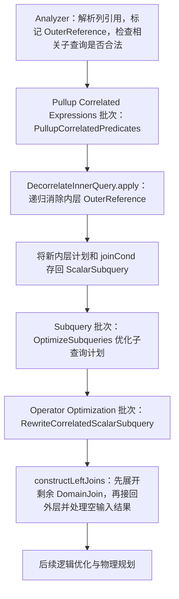

# Spark 去相关与等值改写：从一条 SQL 走到源码

Spark 对本文等值例子的处理是：**把内层 Filter 中的相关等值条件移到上层连接，让内层按等值列分别聚合；内层不再需要从外层取得这个值，因此不必为它建立域连接。** 这几步由不同函数完成，必须沿调用和返回过程一起看。

本文先用一个例子解释改写前后的含义，再定位优化器阶段，最后逐步追踪递归状态。阅读路线：

1. [改写的输入和目标](#query)：相关子查询到底依赖什么？
2. [整条调用链](#pipeline)：分析、去相关、子查询改写分别做什么？
3. [等值例子的逐步执行](#equality)：Filter、Aggregate、上层 Join 如何配合？
4. [非等值例子与 DomainJoin](#domain)：不能直接提升时怎么去相关？
5. [两个判断与 Filter 算法](#checks)：映射提取和跨聚合检查如何接入？
6. [部分等值替换](#partial)：两个外层变量只替换一个时发生什么？
7. [语义边界](#boundaries)：NULL、COUNT、集合算子和 Join 如何处理？
8. [源码阅读入口与成本问题](#sources)：接下来读哪里，结论能说到哪一步？

源码固定为 `d7cb6592d67f92d11239e1cead153d6fc80fce18`，原调查日期 2026-09-06，本文于 2026-09-07 按该快照重新核对并重构。主线限定为启用 `decorrelateInnerQueryEnabled` 的相关标量子查询。计划图和等价 SQL 是根据代码推导的教学表示，省略属性 ID、别名包装及无关投影，**不是运行得到的 EXPLAIN**；本文没有执行 Spark 测试或性能实验。

返回[论文问题与两系统比较](domain-equality-substitution-survey.md)；另见 [DuckDB 独立调查](duckdb-domain-equality-code-study.md)。


## 1. 先看 Spark 要把什么改成什么

从论文 Q1 中取出求最低成绩的部分，暂时不加入外层的另一张 `exams` 表：

```sql
SELECT s.id,
       (SELECT MIN(e2.grade)
        FROM exams e2
        WHERE e2.sid = s.id) AS min_grade
FROM students s;
```

按照 SQL 含义，对每一行学生，内层都要用这个学生的 `s.id` 筛选考试，然后计算最低成绩。“相关”就是内层使用了来自外层的值；“绑定”就是一次内层计算所使用的那个外层取值，例如 `s.id=1`。下文示例假设 id 与 sid 类型一致，grade 与 cutoff 类型一致，先排除隐式类型转换的干扰。

分析后的内层大致是：

```text
Aggregate [分组键: 空] [输出: MIN(e2.grade) AS m]
└─ Filter [e2.sid = outer(s.id)]
   └─ exams e2
```

`outer(s.id)` 表示 `OuterReference(s.id)`，即“到外层取 `s.id`”。它与内层扫描可以直接提供的 `e2.sid` 是两种表达式。这里的 `Aggregate` 分组键为空，表示对筛选后的全部行计算一个结果。

对这个简单 MIN 查询，改写的目标可以用以下 SQL 理解：

```sql
SELECT s.id, g.m AS min_grade
FROM students s
LEFT JOIN (
    SELECT e2.sid, MIN(e2.grade) AS m
    FROM exams e2
    GROUP BY e2.sid
) g ON g.sid = s.id;
```

变化共有三处：


| 位置           | 改写前                    | 改写后                     | 为什么需要                   |
| ------------ | ---------------------- | ----------------------- | ----------------------- |
| 内层 Filter    | `e2.sid = outer(s.id)` | 从这里移走                   | 内层不再逐次读取外层值             |
| 内层 Aggregate | 不分组，只算当前学生             | 按 `e2.sid` 分组，并输出 `sid` | 一次计算不同学生的结果，保留结果属于谁     |
| 外层           | 使用一个标量子查询表达式           | 按 `g.sid = s.id` 左连接    | 为每行学生取回对应结果；无考试时得到 NULL |


**等号没有被当成 TRUE 删除，而是从内层筛选条件变成了上层匹配条件。** 少了这个上层条件，学生就会拿到其他人的最低成绩；少了新增分组键，内层就会算成所有人的共同最低成绩。

例如 `students.id={1,3}`，考试行是 `(sid,grade)={(1,80),(1,60),(2,90)}`：


| 步骤            | 结果                                    |
| ------------- | ------------------------------------- |
| 原查询对学生 1 求值   | `MIN(80,60)=60`                       |
| 原查询对学生 3 求值   | 空输入，`MIN=NULL`                        |
| 改写后内层按 sid 聚合 | `(1,60)`、`(2,90)`                     |
| 接回 students   | 学生 1 得到 60，学生 3 得到 NULL；键 2 没有外层行与它匹配 |


因此，改写后的内层可以多计算外层不需要的键。正确性依靠“分组计算 + 上层按键取回”的完整结构，不要求两个输入具有相同的键集合。这个等值计划形状也直接出现在 Spark 的[实现示例](https://github.com/apache/spark/blob/d7cb6592d67f92d11239e1cead153d6fc80fce18/sql/catalyst/src/main/scala/org/apache/spark/sql/catalyst/optimizer/DecorrelateInnerQuery.scala#L32)和[聚合等值单测的期望计划](https://github.com/apache/spark/blob/d7cb6592d67f92d11239e1cead153d6fc80fce18/sql/catalyst/src/test/scala/org/apache/spark/sql/catalyst/optimizer/DecorrelateInnerQuerySuite.scala#L141)中。


## 2. 这些改写接在 Spark 的哪个阶段

先区分两个动作：**内层去相关**消除内层计划中的 `OuterReference`；**外层子查询改写**把装着内层计划的 `ScalarSubquery` 表达式替换成真正的逻辑 Join。前一个动作完成时，后一个动作还没有发生。

下面是本例经过的关键阶段，省略了中间无关规则：




对应关系如下：


| 阶段      | 谁调用谁                                                                                              | 输入与输出                                                     |
| ------- | ------------------------------------------------------------------------------------------------- | --------------------------------------------------------- |
| 分析      | `Analyzer.ResolveSubquery` 解析子查询，`ValidateSubqueryExpression` 检查相关引用的合法性                          | 得到含 `OuterReference` 的已解析计划；尚未完成去相关                       |
| 内层去相关   | `PullupCorrelatedPredicates.rewriteSubQueries` → 局部 `decorrelate` → `DecorrelateInnerQuery.apply` | 输入内层计划和外层上下文；返回新内层计划、上层连接条件                               |
| 暂存结果    | `PullupCorrelatedPredicates` 重建 `ScalarSubquery`                                                  | 新计划存入 `plan`，连接条件存入 `joinCond`；标量表达式仍在外层表达式中              |
| 子查询内部优化 | `OptimizeSubqueries`                                                                              | 对子查询计划递归执行优化规则                                            |
| 接回外层    | `RewriteCorrelatedScalarSubquery` → `constructLeftJoins`                                          | 消费 `ScalarSubquery` 中的计划与条件，形成外层 Join，标量表达式改为引用 Join 的结果列 |


分析入口见 [ResolveSubquery](https://github.com/apache/spark/blob/d7cb6592d67f92d11239e1cead153d6fc80fce18/sql/catalyst/src/main/scala/org/apache/spark/sql/catalyst/analysis/Analyzer.scala#L2602)。优化阶段顺序见 [Optimizer 批次注册](https://github.com/apache/spark/blob/d7cb6592d67f92d11239e1cead153d6fc80fce18/sql/catalyst/src/main/scala/org/apache/spark/sql/catalyst/optimizer/Optimizer.scala#L215)；标量重写规则属于两个 `Operator Optimization ... Inferring Filters` 批次使用的规则集，见[规则集注册](https://github.com/apache/spark/blob/d7cb6592d67f92d11239e1cead153d6fc80fce18/sql/catalyst/src/main/scala/org/apache/spark/sql/catalyst/optimizer/Optimizer.scala#L151)。**名字叫** `RewriteSubquery` **的后期批次主要注册** `RewritePredicateSubquery`**，不能把它误当成本文标量重写的入口。** [该批次源码](https://github.com/apache/spark/blob/d7cb6592d67f92d11239e1cead153d6fc80fce18/sql/catalyst/src/main/scala/org/apache/spark/sql/catalyst/optimizer/Optimizer.scala#L292)

这里有三个容易混淆的对象：


| 对象               | 它是什么                           | 何时存在                                                 |
| ---------------- | ------------------------------ | ---------------------------------------------------- |
| `ScalarSubquery` | 外层表达式中的标量子查询，内部持有一棵计划树         | 内层去相关前后都可能存在，直到标量重写消费它                               |
| `DomainJoin`     | 去相关时产生的逻辑占位节点，声明“这棵子树还需要这些绑定列” | 仅在需要显式提供绑定时产生；随后由 `rewriteDomainJoins` 展开            |
| 接回外层的 `Join`     | 原外层行与内层结果之间的连接                 | `constructLeftJoins` 构造；即使没有 DomainJoin，这个 Join 仍然需要 |


`DomainJoin` 在类定义中是只有一个 `child` 的逻辑节点：此时没有把生成域的外层子树挂在它旁边。它先声明新增的 `domainAttrs`，等展开时才构造域的输入。这解释了为什么要分两个阶段。[DomainJoin 定义](https://github.com/apache/spark/blob/d7cb6592d67f92d11239e1cead153d6fc80fce18/sql/catalyst/src/main/scala/org/apache/spark/sql/catalyst/plans/logical/basicLogicalOperators.scala#L2486)

对本文简单 MIN 例子，最终使用 `LeftOuter`。对于无法证明每个绑定至多返回一行的标量子查询，代码根据 `needSingleJoin` 选择 `LeftSingle`，以保留标量子查询的多行报错语义。[标记计算](https://github.com/apache/spark/blob/d7cb6592d67f92d11239e1cead153d6fc80fce18/sql/catalyst/src/main/scala/org/apache/spark/sql/catalyst/optimizer/subquery.scala#L583)、[Join 构造](https://github.com/apache/spark/blob/d7cb6592d67f92d11239e1cead153d6fc80fce18/sql/catalyst/src/main/scala/org/apache/spark/sql/catalyst/optimizer/subquery.scala#L901)


## 3. 顺着等值例子走一遍递归

### 3.1 先认识递归传递的三份信息

`DecorrelateInnerQuery.apply` 内部定义了递归函数：

```text
decorrelate(plan, parentOuterReferences, aggregated, underSetOp)
    返回 (newPlan, joinCond, outerReferenceMap)
```

不用先记类型，可以把它们理解成三张工作清单：


| 名字                      | 方向                 | 含义                          | 本例中的值                         |
| ----------------------- | ------------------ | --------------------------- | ----------------------------- |
| `parentOuterReferences` | 从父节点传给子节点          | 上面仍有表达式要在内层使用哪些外层值，请下面提供对应列 | 本例传到扫描时为空                     |
| `outerReferenceMap`     | 从子节点返回父节点          | 外层值现在可以由内层哪一列表示             | `{s.id → e2.sid}`             |
| `joinCond`              | 从子节点返回父节点，最后交给外层重写 | 内层结果应该按什么条件接回外层             | 递归中为 `[e2.sid = outer(s.id)]` |


`parentOuterReferences` **不是整条子查询中出现过的所有外层列**。初始集合为空，各节点只把仍须在内层使用的外层值传下去；如果一个条件已经决定整体移到上层，就不一定还需要为它在内层提供绑定。

另两个参数控制当前上下文：`aggregated=true` 表示当前子树的结果会经过上方的聚合或窗口等处理；`underSetOp=true` 表示正在集合算子之下，不能直接套用普通 Filter 的等值替换。它们不是成本估计结果。[递归参数与返回值](https://github.com/apache/spark/blob/d7cb6592d67f92d11239e1cead153d6fc80fce18/sql/catalyst/src/main/scala/org/apache/spark/sql/catalyst/optimizer/DecorrelateInnerQuery.scala#L464)

### 3.2 向下：Aggregate 设置上下文，Filter 决定条件的去向

从第 1 节的 `Aggregate → Filter → exams` 开始：

```text
① apply 进入根节点
   decorrelate(Aggregate, parentOuterReferences={})

② Aggregate 向下调用 Filter
   聚合表达式 MIN(e2.grade) 自己没有外层引用
   因此传入需求仍为 {}，但设置 aggregated=true

③ Filter 处理 e2.sid = outer(s.id)
   collectEquivalentOuterReferences → {s.id → e2.sid}
   canPullUpOverAgg                  → true
   决定：整个等值条件移到上层，不留在内层 Filter
   留在内层的相关条件为空，父节点需求也为空
   因此向 exams 传递的需求为 {}

④ exams 已经是一棵不含 OuterReference 的子树
   需求为空 → 返回原 exams，不创建 DomainJoin
```

③ 正是等值判断的接入位置：它发生在 `DecorrelateInnerQuery` 的 `case Filter` 中，并且在对子节点递归之前执行；④ 才是是否创建域占位节点的决定位置。[Filter 分支](https://github.com/apache/spark/blob/d7cb6592d67f92d11239e1cead153d6fc80fce18/sql/catalyst/src/main/scala/org/apache/spark/sql/catalyst/optimizer/DecorrelateInnerQuery.scala#L550)、[递归终止分支](https://github.com/apache/spark/blob/d7cb6592d67f92d11239e1cead153d6fc80fce18/sql/catalyst/src/main/scala/org/apache/spark/sql/catalyst/optimizer/DecorrelateInnerQuery.scala#L501)

### 3.3 向上：Filter 返回条件，Aggregate 保住连接键

扫描返回后，逐层构造新计划：

```text
⑤ Filter 返回
   newPlan = exams                         -- 原 Filter 没有剩余条件，消失
   joinCond = [e2.sid = outer(s.id)]       -- 条件保存下来，供上层使用
   outerReferenceMap = {s.id → e2.sid}

⑥ Aggregate 接到这个返回值
   原输出只有 MIN(e2.grade)，缺少 joinCond 所需的 e2.sid
   missingReferences 找到缺失的 e2.sid
   把 e2.sid 同时加入分组键和输出列

   newPlan = Aggregate [e2.sid] [MIN(e2.grade) AS m, e2.sid]
             └─ exams
   joinCond 和映射继续向上返回

⑦ apply 收尾
   必要时对内外层冲突的属性做别名去重
   stripOuterReferences 去掉返回条件中的 OuterReference 包装
   对外返回 (newPlan, [e2.sid = s.id])
```

**Filter 负责发现关系、移走条件；Aggregate 负责增加分组和输出。** `collectEquivalentOuterReferences` 本身不修改 Aggregate，也不创建外层 Join。如果途中有 Project，它也要把上层连接所需但投影中缺少的列补进输出。[Project 分支](https://github.com/apache/spark/blob/d7cb6592d67f92d11239e1cead153d6fc80fce18/sql/catalyst/src/main/scala/org/apache/spark/sql/catalyst/optimizer/DecorrelateInnerQuery.scala#L647)、[Aggregate 分支](https://github.com/apache/spark/blob/d7cb6592d67f92d11239e1cead153d6fc80fce18/sql/catalyst/src/main/scala/org/apache/spark/sql/catalyst/optimizer/DecorrelateInnerQuery.scala#L791)、[apply 收尾](https://github.com/apache/spark/blob/d7cb6592d67f92d11239e1cead153d6fc80fce18/sql/catalyst/src/main/scala/org/apache/spark/sql/catalyst/optimizer/DecorrelateInnerQuery.scala#L1125)

`outerReferenceMap` 用来替换仍在内层的外层引用。例如上方 Project 还使用 `outer(s.id)`，就可以将其表达为 `e2.sid`。本例没有这种额外表达式，所以映射主要说明绑定已有内层表示；**移走这个 Filter 的直接动作是把条件追加到** `joinCond`**。** 递归结束后 `apply` 不再向调用者返回映射，只返回新计划和条件。

### 3.4 外层重写：把暂存的计划和条件变成 Join

`PullupCorrelatedPredicates` 将上述结果存回 `ScalarSubquery`。随后 `RewriteCorrelatedScalarSubquery` 提取这个表达式，并在 `constructLeftJoins` 中：

1. 调用 `rewriteDomainJoins(currentChild, sub, conditions)`。本例没有域占位节点，因此没有域需要展开。
2. 用暂存的 `e2.sid = s.id` 构造左连接。
3. 让原来的标量表达式引用 Join 右侧结果 `m`。

```text
Project [s.id, m AS min_grade]
└─ Join LeftOuter [s.id = e2.sid]
   ├─ students s
   └─ Aggregate [e2.sid] [MIN(e2.grade) AS m, e2.sid]
      └─ exams e2
```

这就得到第 1 节的目标结构。[保存子查询结果](https://github.com/apache/spark/blob/d7cb6592d67f92d11239e1cead153d6fc80fce18/sql/catalyst/src/main/scala/org/apache/spark/sql/catalyst/optimizer/subquery.scala#L583)、[标量表达式提取](https://github.com/apache/spark/blob/d7cb6592d67f92d11239e1cead153d6fc80fce18/sql/catalyst/src/main/scala/org/apache/spark/sql/catalyst/optimizer/subquery.scala#L703)、[构造左连接](https://github.com/apache/spark/blob/d7cb6592d67f92d11239e1cead153d6fc80fce18/sql/catalyst/src/main/scala/org/apache/spark/sql/catalyst/optimizer/subquery.scala#L901)

回到论文完整 Q1 时，上图左侧要换成原来的外层输入，例如 `students s JOIN exams e ON s.id=e.sid`；原先 `e.grade = (标量子查询)` 中的子查询被替换成 `m`，继续由外层条件 `e.grade=m` 约束。不能在接回外层时把这个原有条件丢掉。


## 4. 如果不能直接提升，DomainJoin 怎样完成去相关


### 4.1 非等值条件为什么不能照搬上面的改写

把内层条件改成：

```sql
SELECT s.id,
       (SELECT MIN(e2.grade)
        FROM exams e2
        WHERE e2.grade < s.cutoff) AS min_grade
FROM students s;
```

如果 `cutoff=80`，考试成绩为 `50,70,90`，原子查询先筛出 `50,70`，然后只返回一个值 `50`。

若错误地将 `grade < outer(cutoff)` 提到聚合上方，为了让上层还能比较 `grade`，就得按 `grade` 分组并输出它。这样内层产生 `(grade,MIN)={(50,50),(70,70),(90,90)}`，上层 `grade<80` 会匹配前两组，变成两个结果。原来应当一起参与 MIN 的两行被拆成了两个组。

对等值 `sid=outer(id)`，一个给定的非 NULL `id` 只会选中一个 `sid` 分组；对不等式，一个 cutoff 可以选中多个 grade 分组。这就是此处不能提升的原因，**不是要求** `sid` **在 exams 中唯一**。[跨聚合检查及反例](https://github.com/apache/spark/blob/d7cb6592d67f92d11239e1cead153d6fc80fce18/sql/catalyst/src/main/scala/org/apache/spark/sql/catalyst/optimizer/DecorrelateInnerQuery.scala#L106)、[Filter 中的错误改写示例](https://github.com/apache/spark/blob/d7cb6592d67f92d11239e1cead153d6fc80fce18/sql/catalyst/src/main/scala/org/apache/spark/sql/catalyst/optimizer/DecorrelateInnerQuery.scala#L550)

### 4.2 留下筛选条件，把外层取值变成内层的一列

这次递归过程是：


| 位置                 | 动作                                                                  |
| ------------------ | ------------------------------------------------------------------- |
| Aggregate → Filter | 仍设置 `aggregated=true`                                               |
| Filter             | `grade<outer(cutoff)` 不能提升，也没有可提取的等值映射；必须留在内层计算                     |
| Filter → exams     | 把需求 `{s.cutoff}` 传给子节点                                              |
| exams 的递归终止分支      | 子树无相关引用，但父节点仍需要 cutoff，创建一个新属性 `d_cutoff` 和 `DomainJoin [d_cutoff]` |
| 返回 Filter          | 映射为 `{s.cutoff → d_cutoff}`；将条件改成 `grade<d_cutoff`                  |
| 返回 Aggregate       | 将 `d_cutoff` 加入分组和输出，分别计算每个 cutoff 的最低成绩                            |


此时得到：

```text
内层计划：
Aggregate [d_cutoff] [MIN(e2.grade) AS m, d_cutoff]
└─ Filter [e2.grade < d_cutoff]
   └─ DomainJoin [d_cutoff]              -- 占位节点
      └─ exams e2

递归返回的连接条件：d_cutoff <=> outer(s.cutoff)
apply 收尾后的条件：d_cutoff <=> s.cutoff
```

这里已没有需要从外层逐行读取的 `OuterReference`，但还留有要展开的域占位节点。`<=>` 是 Spark 的 NULL 安全等值比较，用于识别同一个绑定；原查询的 `<` 则仍在 Filter 中计算。[域属性及绑定条件生成](https://github.com/apache/spark/blob/d7cb6592d67f92d11239e1cead153d6fc80fce18/sql/catalyst/src/main/scala/org/apache/spark/sql/catalyst/optimizer/DecorrelateInnerQuery.scala#L501)、[非等值聚合单测](https://github.com/apache/spark/blob/d7cb6592d67f92d11239e1cead153d6fc80fce18/sql/catalyst/src/test/scala/org/apache/spark/sql/catalyst/optimizer/DecorrelateInnerQuerySuite.scala#L182)

### 4.3 第二阶段才把占位节点展开成实际域与普通连接

到了 `constructLeftJoins`，`rewriteDomainJoins` 从 `d_cutoff <=> s.cutoff` 中识别出：`d_cutoff` 应由当前外层输入的 `s.cutoff` 提供。它生成：

```text
DomainJoin [d_cutoff]             Join Inner [无条件，即逻辑笛卡尔积]
└─ exams e2                →     ├─ Aggregate [s.cutoff] [s.cutoff AS d_cutoff]
                                 │  └─ 当前外层输入
                                 └─ exams e2
```

展开后 Join 左侧的去重聚合就是域 D，在本例可以理解为 `SELECT DISTINCT cutoff FROM students`。只保留每个 cutoff 一次，避免相同绑定的重复外层行放大内层聚合输入；原外层行的重复性由最上方接回外层的 Join 保留。

将这个展开结果放回原来的 Filter 和 Aggregate，再接回外层，教学 SQL 是：

```sql
WITH d AS (
    SELECT DISTINCT cutoff AS d_cutoff FROM students
), g AS (
    SELECT d.d_cutoff, MIN(e2.grade) AS m
    FROM d CROSS JOIN exams e2
    WHERE e2.grade < d.d_cutoff
    GROUP BY d.d_cutoff
)
SELECT s.id, g.m AS min_grade
FROM students s
LEFT JOIN g ON g.d_cutoff <=> s.cutoff;
```

这里有两个不同用途的连接：**底部 D 与 exams 的连接提供取值，顶部 students 与 g 的连接取回结果。** 去相关过程只是在构造逻辑计划，不意味着一定物化 CTE，也不意味着物理执行一定先完整生成笛卡尔积；后续规则可以将 Filter 合并进 Join 等。[域属性反查](https://github.com/apache/spark/blob/d7cb6592d67f92d11239e1cead153d6fc80fce18/sql/catalyst/src/main/scala/org/apache/spark/sql/catalyst/optimizer/DecorrelateInnerQuery.scala#L240)、[域展开实现](https://github.com/apache/spark/blob/d7cb6592d67f92d11239e1cead153d6fc80fce18/sql/catalyst/src/main/scala/org/apache/spark/sql/catalyst/optimizer/DecorrelateInnerQuery.scala#L389)

论文中“把域连接向内层下推”的过程，在这段代码中体现为：先把绑定需求沿计划向下传，到不相关子树时按剩余需求建立占位节点，再向上重建 Filter、Aggregate 等算子。等值优化就嵌在这个递归过程里；本文的 Filter 路径没有先构造完整 D，再交给一个独立的“等值域连接删除规则”。


## 5. 两个判断具体检查什么，怎样参与 Filter 改写


### 5.1 判断一：是否发现了直接的“外层列 → 内层列”对应

`collectEquivalentOuterReferences` 只收集这两种结构：

```text
Equality(OuterReference(x), Attribute(y))  →  {x → y}
Equality(Attribute(y), OuterReference(x))  →  {x → y}
```

`Equality` 匹配 `=` 和 `<=>`。这里检查的是传入的 Catalyst 表达式形状：一侧直接是外层引用，另一侧直接是内层属性。不会在这个函数里做代数移项、传递闭包或任意表达式等价类求解；前序处理若已改变表达式形状，则按改变后的形状判断。[收集器](https://github.com/apache/spark/blob/d7cb6592d67f92d11239e1cead153d6fc80fce18/sql/catalyst/src/main/scala/org/apache/spark/sql/catalyst/optimizer/DecorrelateInnerQuery.scala#L152)、[Equality 定义](https://github.com/apache/spark/blob/d7cb6592d67f92d11239e1cead153d6fc80fce18/sql/catalyst/src/main/scala/org/apache/spark/sql/catalyst/expressions/predicates.scala#L1096)

### 5.2 判断二：把这个条件放到聚合上面，是否仍然正确

`canPullUpOverAgg` 接受以下情况：

- 等值的一侧是内层 `Attribute`，或 `Cast.canUpCast` 认可的单射 Cast；另一侧不包含内层属性。
- 整个条件完全不包含内层属性。

`OuterReference` 在这项检查里不会被当成内层 `Attribute`。所以“另一侧不包含内层属性”允许外层列、常量，以及只由它们组成的表达式。单射 Cast 的要求是避免不同内层值转换成同一个值后，被错误拆成多个可匹配分组。[检查实现](https://github.com/apache/spark/blob/d7cb6592d67f92d11239e1cead153d6fc80fce18/sql/catalyst/src/main/scala/org/apache/spark/sql/catalyst/optimizer/DecorrelateInnerQuery.scala#L106)

下表中 x、z 是外层列，y 是内层列。以聚合下方、非集合算子分支中的 Filter 为前提，表中的“无需域”仅指该 Filter 分支，不包含第 7 节的空输入修正等额外处理：


| 输入条件                                                | 能提取映射吗  | 能跨聚合提升吗 | 若没有其他绑定需求，如何处理               |
| --------------------------------------------------- | ------- | ------- | ---------------------------- |
| `y = outer(x)`                                      | 能，`x→y` | 能       | 条件上提；无需域                     |
| `y <=> outer(x)`                                    | 能，`x→y` | 能       | 保留 `<=>` 上提；无需域              |
| `y = outer(x)+1`                                    | 不能      | 能       | 整个条件上提，按 y 分组；仅凭该条件无需域       |
| `CAST(y AS BIGINT) = outer(x)`，y 为 INT 且该 Cast 通过检查 | 不能      | 能       | 整个条件上提，保留 y 供比较；仅凭该条件无需域     |
| `y+1 = outer(x)`                                    | 不能      | 不能      | 当前检查不识别加法的可逆性，需由域提供 x，条件留在内层 |
| `y < outer(x)`                                      | 不能      | 不能      | 由域提供 x，条件留在内层                |
| `outer(x) = outer(z)`                               | 不能      | 能       | 条件整体上提，不必为该条件新增内层分组列         |


**“不能提取映射”不等于“一定产生域”。** 比如 `y=outer(x)+1`，只要 x 没有别的内层用途，把整个条件移到上层后，内层就不再需要 x。反过来，如果上方某个 Project 仍要输出 x，没有直接映射时仍可能需要域。这也是为什么必须同时观察条件去向和剩余绑定需求。

### 5.3 两个结果如何汇入同一个 Filter 分支

下面按源码顺序缩写聚合下方的 Filter 分支。`E` 表示本层等值映射，`P` 表示准备提升的条件，`R` 表示必须留下的相关条件，`L` 表示不相关的本地条件；这些是本文的简写，不是新增的 Spark 数据结构。

```text
输入：Filter(condition, child)，父节点需求 N

1. 按 AND 拆 condition，得到相关条件 C 和本地条件 L
2. E = collectEquivalentOuterReferences(C)
3. 用 canPullUpOverAgg 将 C 分为可提升 P、需留下 R
4. 子节点需求 N_child = (N ∪ R 中的外层引用) − E 的键
5. (child', J_child, M_child) = decorrelate(child, N_child, ...)
6. M = M_child 合并 E
7. R' = 用 M 替换 R 中的 OuterReference
8. 新内层 = Filter(R' AND L, child')；条件为空则直接使用 child'
9. 返回 (新内层, J_child 追加 P, M)
```

步骤 4 的减法解决“哪些值不必再让下面提供”；步骤 7 完成仍在内层的引用替换；步骤 9 保留原条件的上层约束。对 Q1，R 和 N 都为空，所以步骤 4 传下空集合。对第 4 节不等式，R 需要 cutoff 且 E 为空，所以传下 `{cutoff}`。[Filter 的实际组合逻辑](https://github.com/apache/spark/blob/d7cb6592d67f92d11239e1cead153d6fc80fce18/sql/catalyst/src/main/scala/org/apache/spark/sql/catalyst/optimizer/DecorrelateInnerQuery.scala#L603)

具体由两个上下文标志区分以下三种情况：


| 上下文                                   | Filter 采用的处理                                           |
| ------------------------------------- | ------------------------------------------------------ |
| `aggregated=true`，`underSetOp=false`  | 使用上面的算法，按 `canPullUpOverAgg` 分流                        |
| `aggregated=false`，`underSetOp=false` | 所有相关条件都可进入上层 `joinCond`，不要求通过跨聚合检查；传下的需求为父节点需求减去等值映射的键 |
| `underSetOp=true`                     | E 置空，P 置空，相关条件全部留下，绑定需求传给子节点                           |


所以“非等值需要域”也只能限定在前述聚合等上下文。单纯 `Project → Filter[y<outer(x)] → Scan` 的递归可以把不等式直接移到上层，完全不产生域；Spark 有[对应单测](https://github.com/apache/spark/blob/d7cb6592d67f92d11239e1cead153d6fc80fce18/sql/catalyst/src/test/scala/org/apache/spark/sql/catalyst/optimizer/DecorrelateInnerQuerySuite.scala#L105)。这不代表任意多行标量查询都合法，标量行数语义仍由外层流程保证。

### 5.4 为什么 Analyzer 里也能搜到同一个判断函数

`ValidateSubqueryExpression` 的 Filter 检查也调用 `DecorrelateInnerQuery.canPullUpOverAgg`，用于识别跨聚合时不能直接提升的条件。这里检查的是**查询能否被当前去相关路径支持**，不会生成映射或改写计划。

在没有使用新去相关框架的路径中，这类不支持直接提升的条件可能被分析阶段拒绝；使用新框架时，可以允许它们交给后续 DomainJoin 路径处理。因此，看到 `canPullUpOverAgg=false`，不能直接解释成“Spark 不支持这个相关子查询”。要继续看当前是否启用框架，以及这个返回值是在分析阶段还是改写阶段使用。[框架选择](https://github.com/apache/spark/blob/d7cb6592d67f92d11239e1cead153d6fc80fce18/sql/catalyst/src/main/scala/org/apache/spark/sql/catalyst/analysis/ValidateSubqueryExpression.scala#L253)、[分析阶段拒绝条件](https://github.com/apache/spark/blob/d7cb6592d67f92d11239e1cead153d6fc80fce18/sql/catalyst/src/main/scala/org/apache/spark/sql/catalyst/analysis/ValidateSubqueryExpression.scala#L362)、[分析阶段调用点](https://github.com/apache/spark/blob/d7cb6592d67f92d11239e1cead153d6fc80fce18/sql/catalyst/src/main/scala/org/apache/spark/sql/catalyst/analysis/ValidateSubqueryExpression.scala#L444)


## 6. 两个绑定只替换一个：域具体缩小在哪里

现在让一个内层查询同时依赖 `s.id` 和 `s.cutoff`：

```sql
SELECT s.id,
       (SELECT MIN(e2.grade)
        FROM exams e2
        WHERE e2.sid = s.id AND e2.grade < s.cutoff) AS min_grade
FROM students s;
```

把它代入第 5 节的 Filter 算法：

```text
C = [e2.sid = outer(s.id), e2.grade < outer(s.cutoff)]
E = {s.id → e2.sid}
P = [e2.sid = outer(s.id)]
R = [e2.grade < outer(s.cutoff)]
父节点需求 N = {}

N_child = ({} ∪ {s.cutoff}) − {s.id} = {s.cutoff}
```

于是扫描只收到 `{s.cutoff}`，建立 `DomainJoin [d_cutoff]`。返回 Filter 后：

```text
M = {s.id → e2.sid, s.cutoff → d_cutoff}
留下的条件 = e2.grade < d_cutoff
joinCond = [d_cutoff <=> outer(s.cutoff), e2.sid = outer(s.id)]
```

Aggregate 根据 `joinCond` 补入 **sid 和 d_cutoff 两个键**：虽然域中只有 cutoff，内层结果仍要区分完整的 `(sid,cutoff)`。最终关键结构为：

```text
Join LeftOuter [s.id = e2.sid AND s.cutoff <=> d_cutoff]
├─ students s
└─ Aggregate [e2.sid, d_cutoff] [MIN(e2.grade) AS m, e2.sid, d_cutoff]
   └─ Filter [e2.grade < d_cutoff]
      └─ Join Inner [无条件]
         ├─ Aggregate [s.cutoff] [s.cutoff AS d_cutoff]
         │  └─ students s
         └─ exams e2
```

这张图是 [Filter](https://github.com/apache/spark/blob/d7cb6592d67f92d11239e1cead153d6fc80fce18/sql/catalyst/src/main/scala/org/apache/spark/sql/catalyst/optimizer/DecorrelateInnerQuery.scala#L603)、[Aggregate](https://github.com/apache/spark/blob/d7cb6592d67f92d11239e1cead153d6fc80fce18/sql/catalyst/src/main/scala/org/apache/spark/sql/catalyst/optimizer/DecorrelateInnerQuery.scala#L791) 和[域展开](https://github.com/apache/spark/blob/d7cb6592d67f92d11239e1cead153d6fc80fce18/sql/catalyst/src/main/scala/org/apache/spark/sql/catalyst/optimizer/DecorrelateInnerQuery.scala#L389)三段代码共同推导的结果。绑定列的来源发生了分工：id 来自 exams 的 sid，cutoff 来自外层去重域；完整绑定关系由聚合键和上层条件继续维护。

若实际外层绑定只有 `(id,cutoff)={(1,60),(2,90)}`，缩小后的域只有 `{60,90}`。内层可能同时计算 `(1,60),(1,90),(2,60),(2,90)` 中能通过筛选的组合；上层只取回实际需要的 `(1,60)` 和 `(2,90)`。**域的列减少了，但提前约束组合的能力也减少了，不能由此直接推出性能更好。**


## 7. 哪些语义还需要额外处理


### 7.1 普通等值和绑定匹配的 NULL 语义不能混用

主例中的 `e2.sid = s.id` 来自用户 SQL。若 `s.id=NULL`，原条件不会选中 `e2.sid=NULL` 的行；改写后的上层连接仍使用 `=`，同样不会匹配内层的 NULL 分组。MIN 的结果由左连接补成 NULL。

若用户原本写的是 `<=>`，则应允许 NULL 与 NULL 匹配，上层仍保留 `<=>`。映射收集器同时识别两种等值，并不意味着它把两者改成同一种比较。

域生成的 `d_cutoff <=> s.cutoff` 则是在识别“同一个绑定”，需要 NULL 安全比较。真正的业务筛选 `grade<d_cutoff` 仍按原来的三值逻辑求值。这两处比较负责不同的语义。[Equality 匹配](https://github.com/apache/spark/blob/d7cb6592d67f92d11239e1cead153d6fc80fce18/sql/catalyst/src/main/scala/org/apache/spark/sql/catalyst/expressions/predicates.scala#L1096)、[域绑定比较生成](https://github.com/apache/spark/blob/d7cb6592d67f92d11239e1cead153d6fc80fce18/sql/catalyst/src/main/scala/org/apache/spark/sql/catalyst/optimizer/DecorrelateInnerQuery.scala#L501)

### 7.2 COUNT 的空输入结果必须保留

将主例的 MIN 换成 `COUNT(*)`，无考试的学生应该得到 0。但按 sid 分组的内层没有该学生的组，上层左连接会得到 NULL。仅完成等值提升和分组扩展还不够。

源码有两个处理位置，由 `PullupCorrelatedPredicates` 在调用去相关前决定是否设置 `handleCountBug`：


| 位置                                     | 如何修正                                                    | 对域的影响                                                         |
| -------------------------------------- | ------------------------------------------------------- | ------------------------------------------------------------- |
| `constructLeftJoins`                   | 对可在接回外层时处理的情况，加入 `alwaysTrue` 标记；未匹配到内层结果时使用空输入的默认结果    | 简单顶层 COUNT 可以在此修正，无需仅为修正再增加一个内层域连接                            |
| `DecorrelateInnerQuery` 的 Aggregate 分支 | `handleCountBug=true` 且原分组键为空时，在聚合上方建立左域连接，通过标记列恢复空输入结果 | 即使下方等值 Filter 没有生成域，这里也可能新增 `DomainJoin(..., LeftOuter, ...)` |


这不仅涉及 COUNT 这个函数名，还涉及空输入结果为非 NULL 的聚合表达式，以及 HAVING、嵌套聚合等计划结构。标记列用于区分“没有匹配行”和“匹配行的结果本来就是 NULL”，不能把所有情况都粗略改成 `COALESCE(result,0)`。[处理位置的选择](https://github.com/apache/spark/blob/d7cb6592d67f92d11239e1cead153d6fc80fce18/sql/catalyst/src/main/scala/org/apache/spark/sql/catalyst/optimizer/subquery.scala#L583)、[聚合内修正](https://github.com/apache/spark/blob/d7cb6592d67f92d11239e1cead153d6fc80fce18/sql/catalyst/src/main/scala/org/apache/spark/sql/catalyst/optimizer/DecorrelateInnerQuery.scala#L856)、[上层修正](https://github.com/apache/spark/blob/d7cb6592d67f92d11239e1cead153d6fc80fce18/sql/catalyst/src/main/scala/org/apache/spark/sql/catalyst/optimizer/subquery.scala#L929)

### 7.3 集合算子和内层 Join 有独立的接入分支


| 遇到的内层节点                  | 代码在哪里作决定                                                                               | 对等值替换的限制                                                          |
| ------------------------ | -------------------------------------------------------------------------------------- | ----------------------------------------------------------------- |
| `Union` / `SetOperation` | 递归 `case s` 收集各分支的外层引用，并以 `underSetOp=true` 递归                                         | 子分支的 Filter 禁用直接映射和条件提升，各分支按一致位置输出绑定列                             |
| Join 的相关 ON 条件           | 递归 `case Join` 中的 `splitCorrelatedPredicate`，受 `DECORRELATE_JOIN_PREDICATE_ENABLED` 控制 | INNER 情况使用相关条件分流与映射；非 INNER 的 ON 条件保留完整相关谓词，并清空该 ON 条件的等值映射和可提升条件 |
| Join 的两侧都被去相关            | Join 分支合并左右返回的映射                                                                       | 对同一外层变量的左右两种内层表示补充 `<=>`，防止不同绑定的行互相连接                             |


这些判断都在内层递归过程中执行，发生在实际域展开之前。尤其是非 INNER Join，不能直接拿前面的 Filter 算法去删除 ON 中的等值条件；外连接对未匹配行的保留行为需要单独维护。[Join 分支](https://github.com/apache/spark/blob/d7cb6592d67f92d11239e1cead153d6fc80fce18/sql/catalyst/src/main/scala/org/apache/spark/sql/catalyst/optimizer/DecorrelateInnerQuery.scala#L940)、[集合算子分支](https://github.com/apache/spark/blob/d7cb6592d67f92d11239e1cead153d6fc80fce18/sql/catalyst/src/main/scala/org/apache/spark/sql/catalyst/optimizer/DecorrelateInnerQuery.scala#L1053)


## 8. 对照源码阅读，以及成本结论的范围

如果要在编辑器中跟代码，按下面顺序看；行号均属于本文固定快照：


| 要回答的问题              | 文件与入口                                                                                                                                                                                                                                                                                                                                                                                                                                               |
| ------------------- | --------------------------------------------------------------------------------------------------------------------------------------------------------------------------------------------------------------------------------------------------------------------------------------------------------------------------------------------------------------------------------------------------------------------------------------------------- |
| 规则在哪个批次运行？          | [Optimizer.scala:215](https://github.com/apache/spark/blob/d7cb6592d67f92d11239e1cead153d6fc80fce18/sql/catalyst/src/main/scala/org/apache/spark/sql/catalyst/optimizer/Optimizer.scala#L215)；标量重写的规则集在 [151 行](https://github.com/apache/spark/blob/d7cb6592d67f92d11239e1cead153d6fc80fce18/sql/catalyst/src/main/scala/org/apache/spark/sql/catalyst/optimizer/Optimizer.scala#L151)                                                             |
| 从子查询表达式如何进入内层算法？    | [subquery.scala:583](https://github.com/apache/spark/blob/d7cb6592d67f92d11239e1cead153d6fc80fce18/sql/catalyst/src/main/scala/org/apache/spark/sql/catalyst/optimizer/subquery.scala#L583) 的局部 `decorrelate` 和后面的 `ScalarSubquery` 分支                                                                                                                                                                                                              |
| 递归携带什么？             | [DecorrelateInnerQuery.scala:464](https://github.com/apache/spark/blob/d7cb6592d67f92d11239e1cead153d6fc80fce18/sql/catalyst/src/main/scala/org/apache/spark/sql/catalyst/optimizer/DecorrelateInnerQuery.scala#L464) 的 `apply`、返回类型和递归参数                                                                                                                                                                                                           |
| 什么条件可以提升、什么条件能产生映射？ | 同文件 [106 行](https://github.com/apache/spark/blob/d7cb6592d67f92d11239e1cead153d6fc80fce18/sql/catalyst/src/main/scala/org/apache/spark/sql/catalyst/optimizer/DecorrelateInnerQuery.scala#L106)的 `canPullUpOverAgg`、[152 行](https://github.com/apache/spark/blob/d7cb6592d67f92d11239e1cead153d6fc80fce18/sql/catalyst/src/main/scala/org/apache/spark/sql/catalyst/optimizer/DecorrelateInnerQuery.scala#L152)的 `collectEquivalentOuterReferences` |
| 两个判断怎样参与实际改写？       | 同文件 [550 行](https://github.com/apache/spark/blob/d7cb6592d67f92d11239e1cead153d6fc80fce18/sql/catalyst/src/main/scala/org/apache/spark/sql/catalyst/optimizer/DecorrelateInnerQuery.scala#L550)的 Filter 分支，尤其 [603 行](https://github.com/apache/spark/blob/d7cb6592d67f92d11239e1cead153d6fc80fce18/sql/catalyst/src/main/scala/org/apache/spark/sql/catalyst/optimizer/DecorrelateInnerQuery.scala#L603)起的集合运算与递归返回                                |
| 哪里决定创建域，哪里加分组键？     | 同文件 [501 行](https://github.com/apache/spark/blob/d7cb6592d67f92d11239e1cead153d6fc80fce18/sql/catalyst/src/main/scala/org/apache/spark/sql/catalyst/optimizer/DecorrelateInnerQuery.scala#L501)的终止分支、[791 行](https://github.com/apache/spark/blob/d7cb6592d67f92d11239e1cead153d6fc80fce18/sql/catalyst/src/main/scala/org/apache/spark/sql/catalyst/optimizer/DecorrelateInnerQuery.scala#L791)的 Aggregate 分支                                      |
| 暂存的条件最后由谁消费？        | [subquery.scala:901](https://github.com/apache/spark/blob/d7cb6592d67f92d11239e1cead153d6fc80fce18/sql/catalyst/src/main/scala/org/apache/spark/sql/catalyst/optimizer/subquery.scala#L901) 的 `constructLeftJoins`                                                                                                                                                                                                                                  |
| 域占位节点怎样变为普通计划？      | [DecorrelateInnerQuery.scala:389](https://github.com/apache/spark/blob/d7cb6592d67f92d11239e1cead153d6fc80fce18/sql/catalyst/src/main/scala/org/apache/spark/sql/catalyst/optimizer/DecorrelateInnerQuery.scala#L389) 的 `rewriteDomainJoins`                                                                                                                                                                                                        |


可以对照阅读的单测包括：聚合下的[可提升等值](https://github.com/apache/spark/blob/d7cb6592d67f92d11239e1cead153d6fc80fce18/sql/catalyst/src/test/scala/org/apache/spark/sql/catalyst/optimizer/DecorrelateInnerQuerySuite.scala#L141)、[不可提升等值](https://github.com/apache/spark/blob/d7cb6592d67f92d11239e1cead153d6fc80fce18/sql/catalyst/src/test/scala/org/apache/spark/sql/catalyst/optimizer/DecorrelateInnerQuerySuite.scala#L155)、[非等值](https://github.com/apache/spark/blob/d7cb6592d67f92d11239e1cead153d6fc80fce18/sql/catalyst/src/test/scala/org/apache/spark/sql/catalyst/optimizer/DecorrelateInnerQuerySuite.scala#L182)，以及[上方 Project 仍需外层值时的映射和域](https://github.com/apache/spark/blob/d7cb6592d67f92d11239e1cead153d6fc80fce18/sql/catalyst/src/test/scala/org/apache/spark/sql/catalyst/optimizer/DecorrelateInnerQuerySuite.scala#L259)。这些链接提供源码中的期望结构；本文只阅读了测试，没有报告它们运行通过。

最后回到论文讨论的“去掉域以后，会不会失去有价值的提前过滤”：在本文追踪的等值 Filter 路径中，控制流依据是**表达式形状、算子上下文和剩余绑定需求**。该分支没有读取域的行数、NDV 或过滤收益来决定是否仍保留完整 D，也没有同时提交“保留域”和“省略域”两棵候选计划供成本比较。

后面的 `PartitionPruning` 和 `InjectRuntimeFilter` 是独立的优化批次。在适用条件下，它们可能给已经形成的普通连接增加提前过滤；例如动态分区裁剪有基于统计信息的收益判断。但这些规则并没有回到 `DecorrelateInnerQuery` 替它比较论文中的两个去相关方案，也不保证补回全部域过滤效果。[后续批次](https://github.com/apache/spark/blob/d7cb6592d67f92d11239e1cead153d6fc80fce18/sql/core/src/main/scala/org/apache/spark/sql/execution/SparkOptimizer.scala#L65)、[分区裁剪收益判断](https://github.com/apache/spark/blob/d7cb6592d67f92d11239e1cead153d6fc80fce18/sql/core/src/main/scala/org/apache/spark/sql/execution/dynamicpruning/PartitionPruning.scala#L149)

本文能够确认的是这条逻辑计划生成路径及其语义维护方式。省略域以后额外扫描、聚合与组合的成本，和建立域所需的去重、广播或 Shuffle 成本，需要另外做执行计划与性能实验。